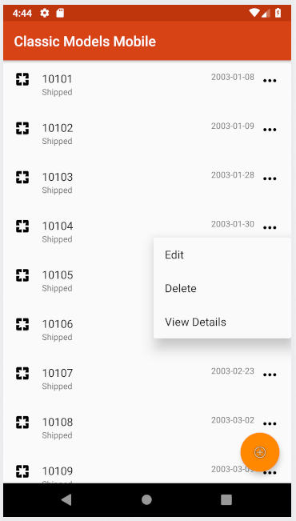
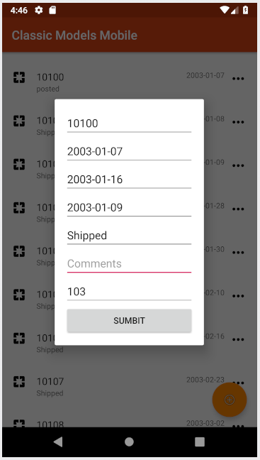

# Classic Models Android App

A kotlin android app for CRUD operations on a RESTful API. The repo for the API is located [here](https://github.com/agmoss/ClassicModelsRestApi).

## GUI

## Built With

* [Kotlin](https://kotlinlang.org/)
* [Android Studio](https://developer.android.com/studio)
* [fuel](https://github.com/kittinunf/fuel) - HTTP networking library for Kotlin/Android

## Authors

* **Andrew Moss** - *Creator* - [agmoss](https://github.com/agmoss)

## License

This project is licensed under the MIT License - see the [LICENSE.md](LICENSE.md) file for details